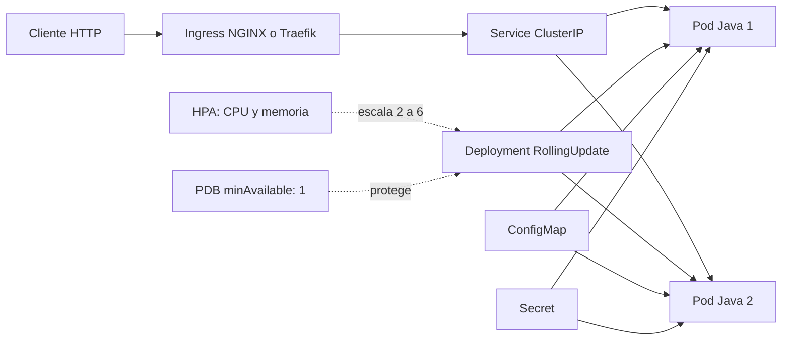
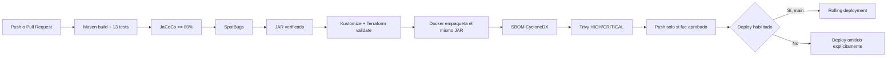

# Demo DevOps Java

[](https://github.com/victorgt26/DevOps-BP/actions/workflows/ci-cd.yml)

Solución de la prueba técnica DevOps sobre una API REST Java 17/Spring Boot. El repositorio contiene build reproducible, pruebas y cobertura, análisis estático, imagen Docker endurecida, despliegue Kubernetes, pipeline CI/CD y una alternativa IaC para AWS.

## Cobertura de requisitos

| Requisito | Implementación |
|---|---|
| Dockerización | JAR verificado una sola vez, Java 17 JRE fijado por digest, usuario no-root y filesystem read-only compatible |
| Build y unit tests | Maven Wrapper y 13 pruebas unitarias/de integración |
| Análisis estático | SpotBugs integrado en `mvn verify` |
| Cobertura | JaCoCo con quality gate mínimo de 80% |
| Build y push | Docker Buildx y GitHub Container Registry (GHCR) |
| Vulnerabilidades | Trivy bloquea vulnerabilidades HIGH/CRITICAL corregibles |
| Kubernetes | Namespace, 2 réplicas, Service, ConfigMap, Secret, Ingress, HPA, PDB y NetworkPolicy |
| Despliegue CI/CD | Imagen aprobada por digest y espera de rollout desde GitHub Actions |
| IaC opcional | Terraform para VPC + EC2 endurecida con k3s en AWS |
| Evidencias | Artifacts de Actions, manifiestos renderizados y comandos de validación documentados |

## Arquitectura





## Estructura del repositorio

```text
.
├── .github/workflows/ci-cd.yml   # Pipeline como código
├── Dockerfile                    # Imagen runtime endurecida
├── k8s/base/                     # Recursos Kubernetes comunes
├── k8s/overlays/aws/             # Adaptación para Traefik/k3s
├── terraform/aws-k3s/            # Infraestructura opcional AWS
├── src/                          # Aplicación y pruebas
└── pom.xml                       # Build, JaCoCo y SpotBugs
```

## Requisitos locales

- Java 17. Validado con Temurin `17.0.13-tem` administrado por SDKMAN.
- Maven 3.9+ o Maven Wrapper (`./mvnw`).
- Docker Desktop.
- `kubectl` 1.30+ y un clúster Kubernetes.
- Ingress NGINX y Metrics Server para validar Ingress y HPA localmente.
- Terraform 1.8+ únicamente para la opción AWS.

## Ejecutar la aplicación

```bash
sdk use java 17.0.13-tem
./mvnw spring-boot:run
```

Endpoints:

- Swagger UI: <http://localhost:8000/api/swagger-ui.html>
- Usuarios: <http://localhost:8000/api/users>
- Readiness: <http://localhost:8000/api/actuator/health/readiness>
- Liveness: <http://localhost:8000/api/actuator/health/liveness>

Ejemplo:

```bash
curl -fsS http://localhost:8000/api/users
curl -fsS -X POST http://localhost:8000/api/users \
  -H 'Content-Type: application/json' \
  -d '{"dni":"0999999999","name":"Test User"}'
```

### Variables de entorno

| Variable | Uso | Valor local predeterminado |
|---|---|---|
| `PORT` | Puerto HTTP | `8000` |
| `SPRING_DATASOURCE_URL` | JDBC URL | `jdbc:h2:file:./test` |
| `SPRING_DATASOURCE_USERNAME` | Usuario de base de datos | `user` |
| `SPRING_DATASOURCE_PASSWORD` | Contraseña de base de datos | `password` |
| `SHUTDOWN_TIMEOUT` | Tiempo de apagado ordenado | `20s` |

Se usan los nombres estándar de externalized configuration de Spring Boot. `application.properties` declara explícitamente `${SPRING_DATASOURCE_URL:valor-default}`, `${SPRING_DATASOURCE_USERNAME:valor-default}` y `${SPRING_DATASOURCE_PASSWORD:valor-default}`: en cada entorno se toma la variable correspondiente y, si no existe, se utiliza el fallback local. Esto evita valores de infraestructura rígidos, elimina alias propios y mantiene la misma convención en Docker, Kubernetes y CI/CD.

## Pruebas, cobertura y análisis estático

```bash
sdk use java 17.0.13-tem
./mvnw -B clean verify
```

`verify` compila, ejecuta 13 pruebas, genera JaCoCo, exige al menos 80% de cobertura de líneas y ejecuta SpotBugs con severidad media o superior. Reportes:

Los tests usan una base H2 en memoria definida en `src/test/resources/application.properties`; no leen ni modifican el archivo `test.mv.db` del entorno local.

- `target/surefire-reports/`
- `target/site/jacoco/index.html`
- `target/spotbugsXml.xml`

El quality gate hace fallar CI si baja la cobertura o SpotBugs encuentra un defecto con la severidad configurada.

## Docker

El JAR se construye y valida antes de crear la imagen. El Dockerfile no compila ni ejecuta Maven: únicamente incorpora en una imagen Java 17 JRE el mismo `target/demo-*.jar` que superó tests, cobertura y análisis estático. Este patrón *build once, promote the same artifact* evita una segunda compilación con resultados potencialmente distintos.

El contenedor ejecuta Java como UID/GID `10001`, sin privilegios y con límites de memoria conscientes del contenedor. La imagen base se fija por digest para que el contenido no cambie silenciosamente aunque el tag se actualice. No se instalan paquetes con `apt`: la imagen contiene únicamente lo proporcionado por Temurin más el JAR validado.

El Dockerfile no declara `HEALTHCHECK`. Kubernetes no consume esa instrucción y ejecuta directamente `startupProbe`, `readinessProbe` y `livenessProbe`; mantener ambos mecanismos duplicaría rutas y tiempos susceptibles de divergir. Para una ejecución local con Docker, la salud puede validarse explícitamente con `curl` contra Actuator.

Para construir localmente hay que generar primero el artefacto validado:

```bash
./mvnw -B --no-transfer-progress clean verify
docker build -t demo-devops-java:local .
docker run --rm -p 8000:8000 \
  -e 'SPRING_DATASOURCE_URL=jdbc:h2:mem:demo;DB_CLOSE_DELAY=-1;DB_CLOSE_ON_EXIT=FALSE' \
  -e SPRING_DATASOURCE_USERNAME=user \
  -e SPRING_DATASOURCE_PASSWORD='local-only-secret' \
  demo-devops-java:local

# En otra terminal
curl -fsS http://localhost:8000/api/actuator/health/readiness
```

## Kubernetes local

Los manifiestos Kustomize crean:

- Namespace dedicado y ServiceAccount sin token automático.
- Deployment con dos réplicas, rolling update y distribución por nodo.
- Startup, readiness y liveness probes independientes.
- Requests/limits y HPA entre 2 y 6 pods.
- ConfigMap y Secret independiente del repositorio.
- Service ClusterIP e Ingress.
- PodDisruptionBudget y NetworkPolicy.
- Security context no-root, `seccomp`, filesystem read-only y capabilities eliminadas.

El Secret real se genera en despliegue y nunca se versiona:

```bash
kubectl apply -f k8s/base/namespace.yaml
kubectl -n demo-devops create secret generic demo-devops-db \
  --from-literal=SPRING_DATASOURCE_USERNAME=user \
  --from-literal=SPRING_DATASOURCE_PASSWORD='local-only-secret' \
  --dry-run=client -o yaml | kubectl apply -f -
```

### Minikube

Minikube es el flujo recomendado para probar una imagen no publicada:

```bash
minikube start
minikube addons enable ingress
minikube addons enable metrics-server
./mvnw -B --no-transfer-progress clean verify
docker build -t demo-devops-java:local .
minikube image load demo-devops-java:local
kubectl apply -f k8s/base/namespace.yaml
kubectl -n demo-devops create secret generic demo-devops-db \
  --from-literal=SPRING_DATASOURCE_USERNAME=user \
  --from-literal=SPRING_DATASOURCE_PASSWORD='local-only-secret' \
  --dry-run=client -o yaml | kubectl apply -f -
kubectl apply -k k8s/base
kubectl -n demo-devops set image deployment/demo-devops-java app=demo-devops-java:local
kubectl -n demo-devops rollout status deployment/demo-devops-java --timeout=180s
```

### Docker Desktop Kubernetes

El `containerd` de Kubernetes puede no compartir imágenes con el daemon de `docker build`. Después de publicar mediante Actions, usar un tag GHCR inmutable:

```bash
kubectl apply -f k8s/base/namespace.yaml
kubectl -n demo-devops create secret generic demo-devops-db \
  --from-literal=SPRING_DATASOURCE_USERNAME=user \
  --from-literal=SPRING_DATASOURCE_PASSWORD='local-only-secret' \
  --dry-run=client -o yaml | kubectl apply -f -
kubectl apply -k k8s/base
kubectl -n demo-devops set image deployment/demo-devops-java \
  app='ghcr.io/victorgt26/devops-bp:<commit-sha>'
kubectl -n demo-devops rollout status deployment/demo-devops-java --timeout=180s
```

El package GHCR debe ser público o Kubernetes necesita un `imagePullSecret`.

### Validar el despliegue

```bash
kubectl -n demo-devops get pods,svc,ingress,hpa,pdb
kubectl -n demo-devops rollout status deployment/demo-devops-java
kubectl -n demo-devops port-forward service/demo-devops-java 8000:80
curl -fsS http://localhost:8000/api/actuator/health/readiness
```

Para el Ingress base, resolver `demo-devops.local` hacia la IP del Ingress. La NetworkPolicy requiere un CNI que implemente políticas y el HPA necesita Metrics Server.

## Pipeline GitHub Actions

El workflow [`.github/workflows/ci-cd.yml`](.github/workflows/ci-cd.yml) se ejecuta en pull requests, push a `main` y manualmente. Sus etapas son:

1. Maven compila una única vez y ejecuta 13 tests, JaCoCo y SpotBugs.
2. Render de los manifiestos base y AWS, validación de esquemas con Kubeconform y publicación como artifact.
3. Formato, inicialización con lockfile inmutable y validación Terraform.
4. El JAR verificado se transfiere como artifact al job de Docker y Buildx lo empaqueta sin recompilar.
5. Trivy genera un SBOM CycloneDX y bloquea vulnerabilidades HIGH/CRITICAL corregibles antes de publicar.
6. Solo desde `main`, la imagen aprobada se publica en GHCR y se obtiene su digest `sha256`.
7. Cuando el despliegue está habilitado, Kubernetes recibe exactamente ese digest y espera el rollout.

Los reportes de calidad, manifiestos renderizados y SBOM permanecen como artifacts durante 14 días. Las acciones externas y las imágenes auxiliares están fijadas por commit o digest; Dependabot propone semanalmente sus actualizaciones, además de las dependencias Maven y Docker.

### Configurar el despliegue desde GitHub

Crear un Environment `production` con:

| Tipo | Nombre | Contenido |
|---|---|---|
| Secret | `KUBE_CONFIG` | Kubeconfig en base64 sin saltos de línea |
| Secret | `SPRING_DATASOURCE_USERNAME` | Usuario de runtime |
| Secret | `SPRING_DATASOURCE_PASSWORD` | Contraseña larga de runtime |
| Variable opcional | `KUSTOMIZE_PATH` | `k8s/base` o `k8s/overlays/aws` |

Para desplegar automáticamente después de un push a `main`, crear además la variable de repositorio `DEPLOY_ENABLED=true`. Como alternativa, ejecutar manualmente el workflow desde `main` y marcar el input `deploy`. Si el despliegue fue solicitado y falta cualquiera de los secretos, el job falla explícitamente.

Generar `KUBE_CONFIG` en macOS/Linux:

```bash
base64 < ~/.kube/config | tr -d '\n'
```

`GITHUB_TOKEN` publica en GHCR sin crear otro token. En pull requests se construye, genera el SBOM y escanea la imagen, pero nunca se autentica contra GHCR ni publica tags. El job de producción usa concurrencia exclusiva y no cancela un rollout iniciado cuando llega un commit nuevo.

## Decisiones de diseño

- **Java 17:** se conserva el LTS requerido por el starter y se fija en local, Docker y CI.
- **Spring Boot 3.5:** actualización dentro de la misma generación mayor para recibir correcciones sin introducir una migración a Spring Boot 4.
- **Build once:** CI prueba y analiza un único JAR; Docker empaqueta exactamente ese binario en lugar de volver a compilarlo con tests omitidos.
- **Usuario no-root:** el UID/GID fijo `10001` reduce privilegios y coincide con el `securityContext` de Kubernetes; crear la identidad explícitamente mantiene permisos y diagnósticos predecibles también al ejecutar con Docker.
- **Actuator:** Kubernetes usa probes semánticas, no una simple comprobación de puerto. El Dockerfile omite deliberadamente `HEALTHCHECK` porque Kubernetes no lo utiliza y ya define sus propios umbrales y periodos.
- **Detección de Kubernetes:** Spring Boot detecta automáticamente la plataforma mediante las variables `*_SERVICE_HOST` y `*_SERVICE_PORT`. No se fuerza un perfil `kubernetes`: `spring.config.activate.on-cloud-platform=kubernetes` se reservaría para propiedades que realmente deban diferir por plataforma. Los endpoints se habilitan globalmente para facilitar la misma validación en local y dentro del clúster.
- **Digest inmutable:** Kubernetes despliega `image@sha256:...`; los tags por commit y `latest` quedan como referencias de trazabilidad y comodidad, no como identidad del artefacto desplegado.
- **Supply chain:** las acciones están fijadas por SHA, las imágenes auxiliares por digest y Dependabot propone actualizaciones revisables.
- **Secret fuera de Git:** el pipeline o los comandos documentados lo crean en runtime.
- **Alta disponibilidad:** dos réplicas, rolling update sin indisponibilidad, PDB y distribución topológica.
- **Defensa en profundidad:** proceso no-root, `seccomp`, filesystem read-only, capabilities eliminadas y NetworkPolicy.
- **Kustomize:** evita duplicar manifiestos y permite adaptar NGINX local a Traefik/k3s.

### Limitación intencional de H2

H2 pertenece al proyecto recibido. En Kubernetes cada réplica usa una base en memoria independiente: la API demuestra despliegue y escalamiento, pero las escrituras no son consistentes entre pods ni sobreviven a un restart. No se comparte un archivo H2 entre réplicas porque no es un patrón seguro para escrituras concurrentes.

Para producción debe sustituirse por PostgreSQL/RDS/Cloud SQL, con driver apropiado, migraciones Flyway/Liquibase, Secret Manager/External Secrets, backups y pruebas de restauración.

## IaC opcional en AWS

[`terraform/aws-k3s`](terraform/aws-k3s) crea VPC, subnet pública, Internet Gateway, rutas, Security Group y una EC2 cifrada que instala k3s. [`k8s/overlays/aws`](k8s/overlays/aws) adapta Ingress y NetworkPolicy a Traefik.

```bash
# Crear terraform/aws-k3s/terraform.tfvars según terraform/aws-k3s/README.md.
AWS_PROFILE=csibol terraform -chdir=terraform/aws-k3s init
AWS_PROFILE=csibol terraform -chdir=terraform/aws-k3s plan -out=tfplan
```

`terraform.tfvars` usa el nombre estándar de Terraform para los valores del entorno real y está excluido de Git; `variables.tf` conserva públicamente el contrato de configuración. No se ejecutó `apply`: EC2, EBS e IPv4 pública pueden generar coste. Revisar CIDR administrativos y key pair antes de aprovisionar. Al finalizar:

```bash
AWS_PROFILE=csibol terraform -chdir=terraform/aws-k3s destroy
```

## Consideraciones adicionales para producción

- DNS apuntando al Load Balancer/Ingress.
- TLS automático con cert-manager y Let's Encrypt.
- WAF, rate limiting, autenticación y CORS según consumidores.
- Métricas Prometheus, dashboards, alertas y logs centralizados.
- Base administrada multi-AZ y estrategia probada de backup/restore.
- Registry privado, firma de imágenes/SBOM y actualización automatizada de dependencias.
- Estrategia de rollback y ambientes separados con aprobación para producción.

## Evidencias y entrega

La evidencia principal será la URL pública de la ejecución exitosa de GitHub Actions. El workflow conserva durante 14 días los reportes de tests/cobertura y los manifiestos Kubernetes renderizados como artifacts. Para la evidencia de Kubernetes se deben tomar capturas, después de un rollout exitoso, de:

```bash
kubectl -n demo-devops get pods,service,ingress,hpa,pdb -o wide
kubectl -n demo-devops rollout status deployment/demo-devops-java
kubectl -n demo-devops get events --sort-by=.lastTimestamp
curl -fsS http://localhost:8000/api/actuator/health/readiness
```

No se versionan logs generados ni capturas con secretos. Las capturas finales pueden adjuntarse a la entrega o incorporarse posteriormente en una carpeta `docs/` si se desea conservarlas junto al repositorio.

Para generar el ZIP después de revisar y hacer commit:

```bash
make zip
```

`git archive` incluye únicamente archivos versionados, por lo que excluye secretos, `target/`, cachés y estado local. En la entrega se deben compartir:

- URL pública del repositorio.
- URL de la ejecución exitosa de GitHub Actions.
- ZIP generado.
- URL pública del endpoint, si se aprovisiona AWS.
- En ausencia de endpoint público, las evidencias locales y artifacts del pipeline.
